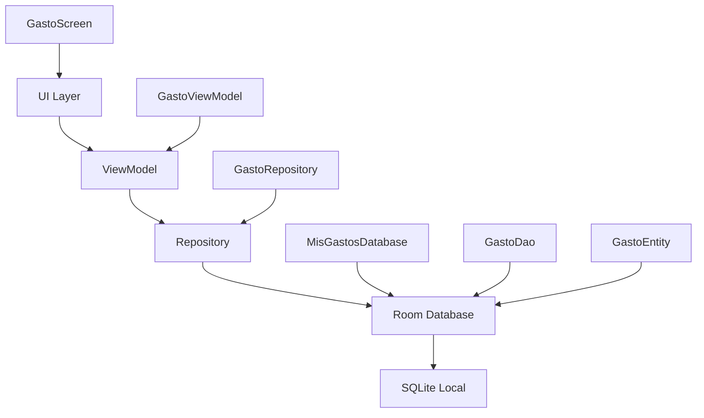

# 💰 Mis Gastos

<div align="center">


**Una aplicación moderna para el control de gastos personales desarrollada en Android con Kotlin y Jetpack Compose**

[](https://github.com/DonGeeo87/MisGastos)
[](LICENSE)
[](https://github.com/DonGeeo87/MisGastos/releases)

</div>

---

## 📱 Capturas de Pantalla

<div align="center">

| Pantalla Principal | Selector de Categorías | Historial de Gastos |
|:---:|:---:|:---:|
|  |  |  |

</div>

---

## ✨ Características

### 🎨 **Interfaz Moderna**
- **Diseño Material Design 3** con colores de marca personalizados
- **Header elegante** con gradiente y información en tiempo real
- **Componentes reutilizables** y consistentes
- **Tema personalizado** con colores #009FE3 y #312783

### 📊 **Gestión de Gastos**
- **15 categorías predefinidas** con emojis intuitivos
- **Selector visual** con scroll horizontal
- **Categorías personalizadas** para necesidades específicas
- **Formato de moneda chilena** (CLP) con separadores de miles

### 💾 **Persistencia de Datos**
- **Room Database** para almacenamiento local
- **Operaciones asíncronas** con corrutinas
- **Persistencia permanente** entre sesiones
- **Arquitectura MVVM** robusta y escalable

### 🔧 **Funcionalidades Avanzadas**
- **Búsqueda de gastos** por nombre
- **Filtrado por categorías**
- **Eliminación individual** con botón intuitivo
- **Eliminación masiva** de todos los gastos
- **Cálculo automático de totales**
- **UI compacta** (75% del tamaño original)
- **Manejo robusto de errores**

---

## 🏗️ Arquitectura



### 🧩 **Componentes Principales**

| Componente | Descripción |
|------------|-------------|
| **GastoScreen** | Pantalla principal con formulario y lista |
| **CategoriaSelector** | Selector visual de categorías con emojis |
| **HeaderWithTotal** | Header con información del total gastado |
| **GastoViewModel** | Lógica de negocio y gestión de estado |
| **GastoRepository** | Abstracción de acceso a datos |
| **Room Database** | Persistencia local con SQLite |

---

## 🚀 Tecnologías Utilizadas

### **Frontend**
- **Jetpack Compose** - UI declarativa moderna
- **Material Design 3** - Sistema de diseño
- **Material Icons Extended** - Librería de iconos completa

### **Backend & Persistencia**
- **Room Database** - Abstracción sobre SQLite
- **Corrutinas** - Programación asíncrona
- **LiveData** - Observación reactiva de datos

### **Arquitectura**
- **MVVM Pattern** - Separación de responsabilidades
- **Repository Pattern** - Abstracción de datos
- **Dependency Injection** - Inyección de dependencias

### **Herramientas**
- **Kotlin** - Lenguaje de programación
- **Gradle** - Sistema de build
- **Android Studio** - IDE de desarrollo

---

## 📦 Instalación

### **Requisitos**
- Android 7.0 (API 24) o superior
- 50 MB de espacio libre

### **Descarga**
1. Ve a la sección [Releases](https://github.com/DonGeeo87/MisGastos/releases)
2. Descarga el archivo `app-debug.apk`
3. Habilita "Instalar aplicaciones desconocidas" en tu dispositivo
4. Instala el APK

### **Desarrollo**
```bash
# Clonar el repositorio
git clone https://github.com/DonGeeo87/MisGastos.git

# Abrir en Android Studio
# Sync del proyecto con Gradle
# Ejecutar en dispositivo/emulador
```

---

## 🎯 Categorías Disponibles

| Emoji | Categoría | Descripción |
|-------|-----------|-------------|
| 🏠 | Hogar | Gastos del hogar y vivienda |
| 🐕 | Mascotas | Cuidado y alimentación de mascotas |
| 📱 | Teléfono | Servicios de telefonía |
| 🌐 | Internet | Servicios de internet |
| 💡 | Luz | Servicios eléctricos |
| 💧 | Agua | Servicios de agua potable |
| 🔥 | Gas | Servicios de gas |
| 🛒 | Supermercado | Compras de alimentos |
| 🚗 | Transporte | Combustible, pasajes, etc. |
| ⚕️ | Salud | Medicamentos, consultas médicas |
| 🎬 | Entretenimiento | Cine, streaming, juegos |
| 👕 | Ropa | Vestimenta y accesorios |
| 📚 | Educación | Libros, cursos, materiales |
| ⚽ | Deportes | Equipamiento deportivo |
| 📦 | Otros | Gastos diversos |

---

## 🔄 Roadmap

### **Versión 1.3.0** (Próximamente)
- [ ] 📊 Gráficos y estadísticas de gastos
- [ ] 📅 Filtros por fechas
- [ ] 💾 Exportación de datos
- [ ] 🌙 Modo oscuro

### **Versión 1.4.0** (Futuro)
- [ ] 📱 Widgets para pantalla de inicio
- [ ] 🔔 Recordatorios de gastos
- [ ] 📈 Análisis de tendencias
- [ ] 🔐 Autenticación biométrica

### **Versión 2.0.0** (Largo plazo)
- [ ] ☁️ Sincronización en la nube
- [ ] 👥 Gastos compartidos
- [ ] 🏦 Integración con bancos
- [ ] 🤖 IA para categorización automática

---

## 👨‍💻 Desarrollo

### **Autor**
**Giorgio Interdonato Palacios**
- 🌐 GitHub: [@DonGeeo87](https://github.com/DonGeeo87)
- 📧 Email: [tu-email@ejemplo.com]
- 💼 LinkedIn: [tu-linkedin]

### **Contribuciones**
¡Las contribuciones son bienvenidas! Por favor:

1. Fork el proyecto
2. Crea una rama para tu feature (`git checkout -b feature/AmazingFeature`)
3. Commit tus cambios (`git commit -m 'Add some AmazingFeature'`)
4. Push a la rama (`git push origin feature/AmazingFeature`)
5. Abre un Pull Request

### **Licencia**
Este proyecto está bajo la Licencia MIT - ver el archivo [LICENSE](LICENSE) para detalles.

---

## 📊 Estadísticas del Proyecto

<div align="center">


</div>

---

<div align="center">

**⭐ ¡Dale una estrella al proyecto si te gusta! ⭐**

Desarrollado con ❤️ por [Giorgio Interdonato Palacios](https://github.com/DonGeeo87)

</div>
